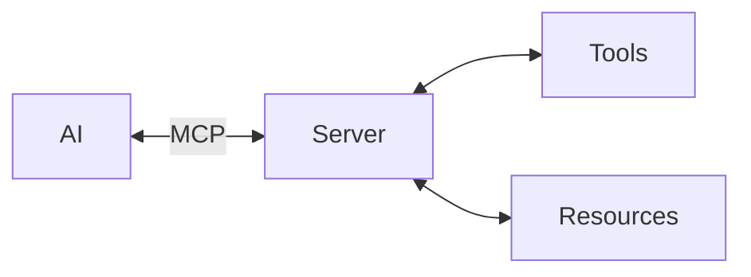
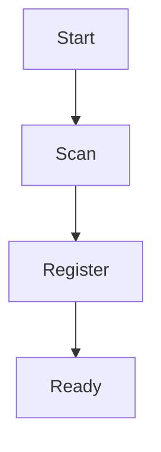
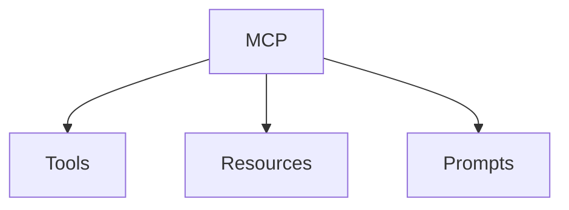
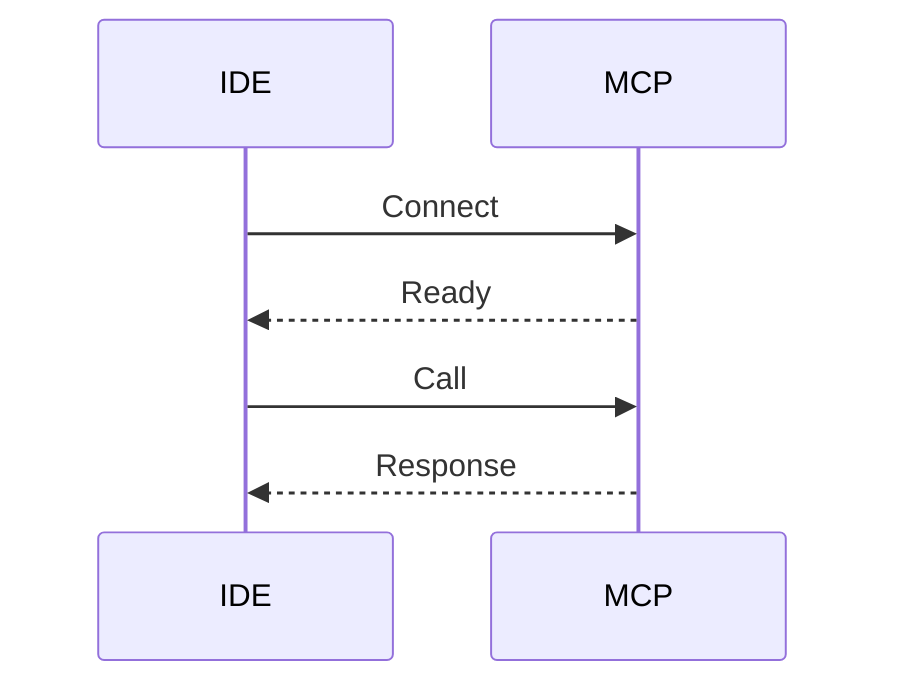
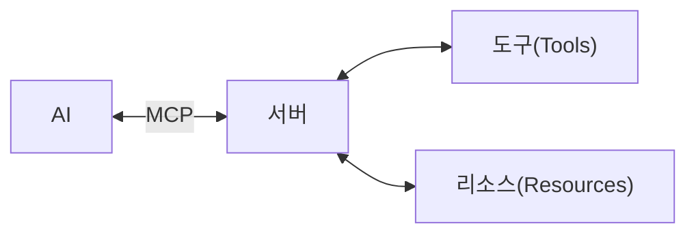

# MCP Server Starter (TypeScript)

<div align="center">

[](https://modelcontextprotocol.io)
[](https://www.typescriptlang.org/)
[](https://nodejs.org/)
[](LICENSE)

A minimal, production-ready TypeScript starter template for building [Model Context Protocol (MCP)](https://modelcontextprotocol.io) servers.

</div>

## 🎯 Motivation

The Model Context Protocol (MCP) is an open protocol that standardizes how AI applications connect to data sources and tools. Think of it as "USB-C for AI" - a universal standard that allows any AI model to connect with any data source or tool through a consistent interface.



This starter template provides:

- ✅ **Minimal boilerplate** to get you started quickly
- ✅ **Auto-loading architecture** for tools, resources, and prompts
- ✅ **TypeScript best practices** with strict typing
- ✅ **Production-ready structure** that scales with your project
- ✅ **Working example** (echo tool) to demonstrate the pattern

Whether you're building integrations for databases, APIs, file systems, or custom business tools, this template helps you create MCP servers that can be used by any MCP-compatible client (like Claude Desktop, IDEs, or custom applications).

## 📋 Table of Contents

- [Features](#-features)
- [Prerequisites](#-prerequisites)
- [Installation](#-installation)
- [Quick Start](#-quick-start)
- [Transport Modes](#-transport-modes)
  - [Stdio Mode](#stdio-mode-default)
  - [HTTP Mode](#http-mode-sse--json-rpc)
  - [Environment Variables](#environment-variables)
  - [Configuration Examples](#configuration-examples)
- [Docker Support](#-docker-support)
- [Project Structure](#-project-structure)
- [Development Guide](#-development-guide)
  - [Using Code Generators](#using-code-generators)
  - [Adding a New Tool](#adding-a-new-tool)
  - [Adding a Resource](#adding-a-resource)
  - [Adding a Prompt](#adding-a-prompt)
- [Testing with MCP Inspector](#-testing-with-mcp-inspector)
- [Configuration](#-configuration)
- [Commands](#-commands)
- [Integration](#-integration)
- [Contributing](#-contributing)
- [License](#-license)

## ✨ Features

- 🚀 **Auto-loading Module System** - Drop new tools, resources, or prompts into their directories and they're automatically registered
- 🛠️ **TypeScript First** - Full type safety with strict TypeScript configuration
- 📦 **Minimal Dependencies** - Only essential packages included
- 🧪 **Built-in Testing** - Uses Node.js native test runner
- 🔍 **MCP Inspector Support** - Test your server with the official MCP Inspector
- 📝 **Extensible Architecture** - Clear patterns for adding new capabilities
- 🎯 **Example Implementation** - Working echo tool demonstrates the pattern
- ⚡ **Code Generators** - Hygen scaffolding for rapid module creation
- 🌐 **Dual Transport Support** - Both stdio and HTTP (SSE + JSON-RPC) transports
- 🐳 **Docker Ready** - Containerized deployment with multi-stage builds

## 📚 Prerequisites

> [!IMPORTANT]
> Ensure you have Node.js version 20.11.0 or higher installed before proceeding.

- Node.js >= 20.11.0
- npm or yarn
- Basic understanding of TypeScript
- Familiarity with the [Model Context Protocol](https://modelcontextprotocol.io) concepts

## 📦 Installation

### Clone and Setup

```bash
# Clone the repository
git clone https://github.com/alexanderop/mcp-server-starter-ts.git
cd mcp-server-starter-ts

# Install dependencies
npm install

# Build the project
npm run build
```

### Using as a Template

You can also use this as a GitHub template:

1. Click "Use this template" on GitHub
2. Create your new repository
3. Clone and start building your MCP server

## 🚀 Quick Start

> [!TIP]
> Use the MCP Inspector to test your server interactively during development!

1. **Build the server:**

   ```bash
   npm run build
   ```

2. **Test with MCP Inspector:**

   ```bash
   npm run inspect
   ```

   This opens the MCP Inspector where you can interact with your server's tools, resources, and prompts.

3. **Run tests:**
   ```bash
   npm test
   ```

## 🚀 Transport Modes

This server supports two transport modes: **stdio** (default) and **HTTP** (Streamable SSE + JSON-RPC).

### Stdio Mode (Default)

Traditional stdio transport for local development and desktop clients:

```bash
# Run with stdio transport
npm run serve:stdio

# Or simply (defaults to stdio)
npm run build && node build/index.js
```

### HTTP Mode (SSE + JSON-RPC)

Streamable HTTP transport for web deployments and remote access:

```bash
# Run with HTTP transport on port 3000
npm run serve:http

# Test with MCP Inspector
npm run inspect:http
```

The HTTP transport exposes:

- **SSE endpoint** (GET): `http://localhost:3000/mcp` - For server-sent events
- **JSON-RPC endpoint** (POST): `http://localhost:3000/mcp` - For requests

### Environment Variables

Configure the server behavior using environment variables:

| Variable            | Description                           | Default |
| ------------------- | ------------------------------------- | ------- |
| `STARTER_TRANSPORT` | Transport mode: `stdio` or `http`     | `stdio` |
| `PORT`              | HTTP server port (HTTP mode only)     | `3000`  |
| `CORS_ORIGIN`       | CORS allowed origins (HTTP mode only) | `*`     |

### Configuration Examples

#### VS Code (`mcp.json` or `.vscode/mcp.json`)

```json
{
  "servers": {
    "starter-stdio": {
      "type": "stdio",
      "command": "node",
      "args": ["./build/index.js"]
    },
    "starter-http": {
      "type": "http",
      "url": "http://localhost:3000/mcp"
    }
  }
}
```

#### Claude Desktop

Add to your Claude Desktop configuration:

```json
{
  "mcpServers": {
    "mcp-server-starter": {
      "command": "node",
      "args": ["/path/to/mcp-server-starter/build/index.js"]
    }
  }
}
```

## 🐳 Docker Support

The server includes Docker support for easy deployment:

### Quick Start with Docker

```bash
# Build and run with Docker Compose
docker compose up --build

# Or run the pre-built image
docker run -p 3000:3000 ghcr.io/alexanderopalic/mcp-server-starter-ts:latest
```

### Docker Configuration

The Docker container runs in HTTP mode by default. Override settings with environment variables:

```bash
docker run -p 3000:3000 \
  -e CORS_ORIGIN="https://example.com" \
  -e PORT=3000 \
  ghcr.io/alexanderopalic/mcp-server-starter-ts:latest
```

### Development with Docker

Use the development profile for hot reload:

```bash
docker compose --profile dev up mcp-server-starter-dev
```

This mounts your source code and enables live reloading on port 3001.

## 📁 Project Structure

```
mcp-server-starter-ts/
├── src/
│   ├── index.ts              # Main entry point
│   ├── registry/             # Auto-loading system
│   │   ├── auto-loader.ts    # Module auto-discovery
│   │   └── types.ts          # TypeScript interfaces
│   ├── tools/                # Tool implementations
│   │   └── echo.ts           # Example echo tool
│   ├── resources/            # Resource implementations (empty by default)
│   └── prompts/              # Prompt implementations (empty by default)
├── tests/                    # Test files
├── _templates/               # Hygen generator templates
│   ├── tool/new/            # Tool generator
│   ├── prompt/new/          # Prompt generator
│   └── resource/new/        # Resource generator
├── build/                    # Compiled JavaScript (generated)
├── mcp.json                  # MCP server configuration
├── package.json              # Node.js dependencies
├── tsconfig.json             # TypeScript configuration
├── eslint.config.js          # ESLint configuration
└── README.md
```

### How Auto-Loading Works



> [!TIP]
> Simply drop your module files into the appropriate directory (`tools/`, `resources/`, or `prompts/`) and they'll be automatically loaded when the server starts!

## 🛠️ Development Guide

### Using Code Generators

> [!TIP]
> The fastest way to create new modules is using the built-in Hygen generators!

This project includes Hygen scaffolding for rapid module creation. Each generator creates both the implementation file and a corresponding test file.

#### Generate a New Tool

```bash
npm run gen:tool
```

You'll be prompted for:

- **Name**: Enter in kebab-case (e.g., `text-transform`)
- **Description**: Brief description of what the tool does

#### Generate a New Prompt

```bash
npm run gen:prompt
```

You'll be prompted for:

- **Name**: Enter in kebab-case (e.g., `code-review`)
- **Description**: Brief description of the prompt template

#### Generate a New Resource

```bash
npm run gen:resource
```

You'll be prompted for:

- **Name**: Enter in kebab-case (e.g., `app-status`)
- **Description**: Brief description of the resource

#### Command Line Usage

You can also provide parameters directly:

```bash
npx hygen tool new --name my-tool --description "Does something useful"
npx hygen prompt new --name my-prompt --description "Generates helpful text"
npx hygen resource new --name my-resource --description "Provides data"
```

Generated files:

- **Implementation**: `src/{tools|prompts|resources}/[name].ts`
- **Test**: `tests/[name].test.ts`

The auto-loader automatically discovers and registers all generated modules - no additional configuration needed!

### Module Types Overview



### Adding a New Tool

> [!NOTE]
> Tools are functions that can be called by the AI to perform specific actions or computations.

Tools allow your MCP server to perform actions. Create a new file in `src/tools/`:

```typescript
// src/tools/calculate.ts
import { z } from 'zod';
import type { RegisterableModule } from '../registry/types.js';
import type { McpServer } from '@modelcontextprotocol/sdk/server/mcp.js';

const calculateModule: RegisterableModule = {
  type: 'tool',
  name: 'calculate',
  description: 'Perform basic arithmetic calculations',
  register(server: McpServer) {
    server.tool(
      'calculate',
      'Perform basic arithmetic calculations',
      {
        operation: z.enum(['add', 'subtract', 'multiply', 'divide']).describe('The arithmetic operation to perform'),
        a: z.number().describe('First number'),
        b: z.number().describe('Second number'),
      },
      (args) => {
        let result: number;
        switch (args.operation) {
          case 'add':
            result = args.a + args.b;
            break;
          case 'subtract':
            result = args.a - args.b;
            break;
          case 'multiply':
            result = args.a * args.b;
            break;
          case 'divide':
            if (args.b === 0) throw new Error('Division by zero');
            result = args.a / args.b;
            break;
        }

        return {
          content: [
            {
              type: 'text',
              text: `Result: ${result}`,
            },
          ],
        };
      }
    );
  },
};

export default calculateModule;
```

### Adding a Resource

> [!NOTE]
> Resources provide read-only access to data that can be consumed by AI clients.

Resources provide data that can be read by clients. Create a new file in `src/resources/`:

```typescript
// src/resources/config.ts
import type { RegisterableModule } from '../registry/types.js';
import type { McpServer } from '@modelcontextprotocol/sdk/server/mcp.js';

const configResource: RegisterableModule = {
  type: 'resource',
  name: 'config',
  description: 'Application configuration',
  register(server: McpServer) {
    server.resource('config://app/settings', 'Application settings', 'application/json', async () => {
      const settings = {
        version: '1.0.0',
        environment: process.env.NODE_ENV || 'development',
        features: {
          autoSave: true,
          darkMode: false,
        },
      };

      return {
        contents: [
          {
            uri: 'config://app/settings',
            mimeType: 'application/json',
            text: JSON.stringify(settings, null, 2),
          },
        ],
      };
    });
  },
};

export default configResource;
```

### Adding a Prompt

> [!NOTE]
> Prompts are reusable templates that help structure interactions with the AI model.

Prompts are reusable prompt templates. Create a new file in `src/prompts/`:

```typescript
// src/prompts/code-review.ts
import { z } from 'zod';
import type { RegisterableModule } from '../registry/types.js';
import type { McpServer } from '@modelcontextprotocol/sdk/server/mcp.js';

const codeReviewPrompt: RegisterableModule = {
  type: 'prompt',
  name: 'code-review',
  description: 'Generate a code review prompt',
  register(server: McpServer) {
    server.prompt(
      'code-review',
      'Generate a comprehensive code review',
      {
        language: z.string().describe('Programming language'),
        code: z.string().describe('Code to review'),
        focus: z.string().optional().describe('Specific areas to focus on'),
      },
      (args) => {
        return {
          messages: [
            {
              role: 'user',
              content: {
                type: 'text',
                text: `Please review the following ${args.language} code:

\`\`\`${args.language}
${args.code}
\`\`\`

${args.focus ? `Focus areas: ${args.focus}` : ''}

Please provide:
1. Code quality assessment
2. Potential bugs or issues
3. Performance considerations
4. Security concerns
5. Suggestions for improvement`,
              },
            },
          ],
        };
      }
    );
  },
};

export default codeReviewPrompt;
```

## 🔍 Testing with MCP Inspector

The MCP Inspector is a powerful tool for testing your server:

```bash
npm run inspect
```

This command:

1. Builds your TypeScript code
2. Launches the MCP Inspector
3. Connects to your server
4. Provides an interactive UI to test tools, resources, and prompts

### Interactive Development Mode

For rapid testing and development, use the interactive dev mode:

```bash
npm run dev
```

This starts an interactive REPL where you can paste JSON-RPC messages directly and see responses in real-time. Perfect for testing your MCP server during development!

### JSON-RPC Examples for Dev Mode

Once you run `npm run dev`, you can paste these JSON-RPC messages directly.

> [!IMPORTANT] > **MCP Protocol Handshake Required**
>
> The MCP protocol requires a specific initialization sequence before you can use tools, resources, or prompts:
>
> 1. **Initialize Request** - Client sends capabilities and receives server capabilities
> 2. **Initialized Notification** - Client confirms it's ready (no response expected)
>
> **Why is the initialized notification needed?**
>
> - It confirms the client has processed the initialization response and is ready
> - It enables bidirectional communication - after this, the server can send requests to the client
> - Without it, the server won't send notifications (like `tools/list_changed`) or make requests (like `sampling/createMessage`)
> - This follows a pattern similar to TCP's handshake, ensuring both parties are ready before actual communication begins
>
> The dev server does NOT automatically perform this handshake. You must send these messages manually first.

#### 1. Initialize Connection (Required First!)

Step 1 - Send initialize request:

```json
{
  "jsonrpc": "2.0",
  "method": "initialize",
  "params": { "protocolVersion": "1.0.0", "capabilities": {}, "clientInfo": { "name": "dev-client", "version": "1.0.0" } },
  "id": 1
}
```

Step 2 - After receiving the response, send initialized notification:

```json
{ "jsonrpc": "2.0", "method": "notifications/initialized" }
```

Now the server is ready to handle requests!

#### 2. List Available Tools

```json
{ "jsonrpc": "2.0", "method": "tools/list", "params": {}, "id": 2 }
```

#### 3. Call the Echo Tool

```json
{ "jsonrpc": "2.0", "method": "tools/call", "params": { "name": "echo", "arguments": { "text": "Hello, MCP!" } }, "id": 3 }
```

#### 4. List Resources

```json
{ "jsonrpc": "2.0", "method": "resources/list", "params": {}, "id": 4 }
```

#### 5. Read a Resource

```json
{ "jsonrpc": "2.0", "method": "resources/read", "params": { "uri": "timestamp://current/iso" }, "id": 5 }
```

#### 6. List Prompts

```json
{ "jsonrpc": "2.0", "method": "prompts/list", "params": {}, "id": 6 }
```

#### 7. Get a Prompt

```json
{
  "jsonrpc": "2.0",
  "method": "prompts/get",
  "params": { "name": "generate-readme", "arguments": { "projectName": "My Project", "description": "A cool project" } },
  "id": 7
}
```

> [!TIP] > **Using Dev Mode:**
>
> 1. Run `npm run dev` to start the interactive server
> 2. Copy any JSON-RPC message above and paste it into the terminal
> 3. The server will show the response with syntax highlighting
> 4. Type `help` for available commands or `exit` to quit
>
> **Important:** Always send the initialize message first to establish the connection!

## ⚙️ Configuration

### TypeScript Configuration

The project uses strict TypeScript settings for maximum type safety. Key configurations in `tsconfig.json`:

- Target: ES2022
- Module: ES2022 with Node module resolution
- Strict mode enabled
- Source maps for debugging

### Available Scripts

| Command                | Description                       |
| ---------------------- | --------------------------------- |
| `npm run build`        | Compile TypeScript to JavaScript  |
| `npm run lint`         | Run ESLint checks                 |
| `npm run lint:fix`     | Auto-fix ESLint issues            |
| `npm run typecheck`    | Type-check without building       |
| `npm test`             | Run tests                         |
| `npm run test:watch`   | Run tests in watch mode           |
| `npm run inspect`      | Launch MCP Inspector              |
| `npm run dev`          | Interactive development mode      |
| `npm run gen:tool`     | Generate a new tool with test     |
| `npm run gen:prompt`   | Generate a new prompt with test   |
| `npm run gen:resource` | Generate a new resource with test |

## 🔌 Integration

### How MCP Integration Works



### With VS Code (Recommended)

> [!TIP]
> The easiest way to use your MCP server is through VS Code with MCP support extensions.

1. **Build your server:**

   ```bash
   npm run build
   ```

2. **Open the project in VS Code:**

   ```bash
   code .
   ```

3. **Use the included `mcp.json` configuration:**

   The project includes an `mcp.json` file that VS Code MCP extensions can use to automatically start your server:

   ```json
   {
     "servers": {
       "starter": {
         "type": "stdio",
         "command": "node",
         "args": ["./build/index.js"]
       }
     }
   }
   ```

4. **Install a VS Code MCP extension:**
   - Open VS Code Extensions (⇧⌘X on macOS, Ctrl+Shift+X on Windows/Linux)
   - Search for "MCP" or "Model Context Protocol"
   - Install an MCP-compatible extension
   - The extension will automatically detect and use your `mcp.json` configuration

> [!NOTE]
> The `mcp.json` file tells VS Code how to start your MCP server. When you open a project with this file, compatible extensions will automatically recognize it as an MCP server project.

### With Claude Desktop

> [!IMPORTANT]
> Make sure to build your server before configuring Claude Desktop. The server must be compiled to JavaScript.

1. Build your server:

   ```bash
   npm run build
   ```

2. Add to Claude Desktop configuration:

   > [!WARNING]
   > Configuration file location varies by operating system:
   >
   > - **macOS**: `~/Library/Application Support/Claude/claude_desktop_config.json`
   > - **Windows**: `%APPDATA%\Claude\claude_desktop_config.json`
   > - **Linux**: `~/.config/Claude/claude_desktop_config.json`

   ```json
   {
     "mcpServers": {
       "my-server": {
         "command": "node",
         "args": ["/path/to/your/server/build/index.js"]
       }
     }
   }
   ```

3. Restart Claude Desktop

> [!CAUTION]
> Always use absolute paths in your configuration. Relative paths may not work correctly.

### With Custom Clients

Use the MCP SDK to connect to your server:

```typescript
import { Client } from '@modelcontextprotocol/sdk/client/index.js';
import { StdioClientTransport } from '@modelcontextprotocol/sdk/client/stdio.js';

const transport = new StdioClientTransport({
  command: 'node',
  args: ['/path/to/your/server/build/index.js'],
});

const client = new Client(
  {
    name: 'my-client',
    version: '1.0.0',
  },
  { capabilities: {} }
);

await client.connect(transport);
```

## 🤝 Contributing

Contributions are welcome! Please feel free to submit a Pull Request. For major changes, please open an issue first to discuss what you would like to change.

1. Fork the repository
2. Create your feature branch (`git checkout -b feature/AmazingFeature`)
3. Commit your changes (`git commit -m 'Add some AmazingFeature'`)
4. Push to the branch (`git push origin feature/AmazingFeature`)
5. Open a Pull Request

## 📄 License

This project is licensed under the MIT License - see the [LICENSE](LICENSE) file for details.

## 🔗 Resources

- [Model Context Protocol Documentation](https://modelcontextprotocol.io)
- [MCP SDK Repository](https://github.com/modelcontextprotocol/sdk)
- [MCP Servers Collection](https://github.com/modelcontextprotocol/servers)
- [MCP Inspector](https://github.com/modelcontextprotocol/inspector)

## 🐛 Troubleshooting

> [!WARNING]
> Common issues and their solutions:

| Issue                       | Solution                                                            |
| --------------------------- | ------------------------------------------------------------------- |
| `Cannot find module` errors | Ensure you've run `npm run build` before starting the server        |
| Server not connecting       | Check that you're using absolute paths in configuration             |
| Tools not loading           | Verify your module exports match the `RegisterableModule` interface |
| TypeScript errors           | Run `npm run typecheck` to identify type issues                     |
| Auto-loading fails          | Check file names and ensure modules are in correct directories      |

### Development

- ✅ **Type Safety**: Use TypeScript's strict mode for catching errors early
- ✅ **Modular Design**: Keep tools, resources, and prompts focused on single responsibilities
- ✅ **Error Handling**: Always handle errors gracefully and provide meaningful messages
- ✅ **Validation**: Use Zod schemas to validate all inputs
- ✅ **Testing**: Write tests for critical functionality

---

<div align="center">

Built with ❤️ for the MCP community

[Report Issues](https://github.com/alexanderop/mcp-server-starter-ts/issues) · [Request Features](https://github.com/alexanderop/mcp-server-starter-ts/issues) · [Documentation](https://modelcontextprotocol.io)

</div>

## Project-specific Guide (This Repository)

This project is a Fitness & Nutrition themed MCP server with ready-to-use tools and examples. Use the commands below to build, run, and inspect the server locally.

### Included Tools

- echo
  - Description: Echo back the provided text
  - Example call (Inspector → tools/call):
    ```json
    { "name": "echo", "arguments": { "text": "Hello, MCP!" } }
    ```
- generate_workout_plan
  - Description: Generate a weekly workout plan tailored to your goal and environment
  - Arguments:
    - goal: "fatLoss" | "muscleGain" | "boxingSkill" | "endurance"
    - daysPerWeek: number (2-6)
    - experienceLevel: "beginner" | "intermediate" | "advanced"
    - hasGymAccess: boolean
    - targetBodyParts?: ["chest" | "back" | "legs" | "shoulders" | "arms" | "core" | "fullBody"][]
  - Example:
    ```json
    {
      "name": "generate_workout_plan",
      "arguments": {
        "goal": "muscleGain",
        "daysPerWeek": 3,
        "experienceLevel": "beginner",
        "hasGymAccess": true
      }
    }
    ```
- supplement_recommendations
  - Description: Recommend supplements for your training goal and conditions (KR arguments)
  - Arguments:
    - 목표: "muscleGain" | "fatLoss" | "boxingSkill" | "endurance" | "recovery"
    - 주당*운동*횟수: number (2-7)
    - 관절*부상*통증: boolean
    - 피로*회복*필요\_여부: boolean
    - budget?: "low" | "medium" | "high"
  - Example:
    ```json
    {
      "name": "supplement_recommendations",
      "arguments": {
        "목표": "fatLoss",
        "주당_운동_횟수": 4,
        "관절_부상_통증": false,
        "피로_회복_필요_여부": true,
        "budget": "medium"
      }
    }
    ```

### Included Resources

- timestamp://current/iso
- system-info://host/env

Example (Inspector → resources/read):

```json
{ "uri": "timestamp://current/iso" }
```

### Included Prompts

- generate-readme
- code-analyzer

Example (Inspector → prompts/get):

```json
{
  "name": "generate-readme",
  "arguments": {
    "projectName": "My Project",
    "description": "A cool project"
  }
}
```

### How to Run (Windows/PowerShell)

Prerequisites:

- Node.js >= 20.11.0

Build:

```powershell
npm run build
```

Stdio mode (default):

```powershell
npm start
# or
node build/index.js
```

Interactive dev REPL:

```powershell
npm run dev
# If needed:
node dev.js
```

HTTP mode (SSE + JSON-RPC):

```powershell
$env:STARTER_TRANSPORT = 'http'
npm start
# Server endpoint: http://localhost:3000/mcp
```

### Using MCP Inspector

Inspect a stdio server:

```powershell
npx @modelcontextprotocol/inspector node build/index.js
```

Inspect an HTTP server:

```powershell
$env:STARTER_TRANSPORT = 'http'
npm start
npx @modelcontextprotocol/inspector http://localhost:3000/mcp
```

### Windows Notes / Troubleshooting

- Error: "AbortController is not defined" when running Inspector
  - Cause: Running under an older Node version (< 18)
  - Fix: Use Node 20+ (this repo recommends >= 20.11.0)
  - Check versions/paths:
    ```powershell
    node -v
    where node
    ```

## 한국어 번역

### 🎯 동기(Motivation)

Model Context Protocol(MCP)는 AI 애플리케이션이 데이터 소스와 도구에 연결하는 방식을 표준화하는 개방형 프로토콜입니다. 쉽게 말해, AI 세계의 “USB‑C”와 같아서 어떤 AI도 일관된 인터페이스로 어떤 도구나 데이터 소스와 연결할 수 있게 합니다.



이 스타터 템플릿은 다음을 제공합니다:

- ✅ 최소한의 보일러플레이트로 빠른 시작
- ✅ 도구/리소스/프롬프트 자동 로딩 아키텍처
- ✅ 엄격한 타입의 TypeScript 베스트 프랙티스
- ✅ 확장 가능한 프로덕션 준비 구조
- ✅ 동작하는 예제(echo 툴) 포함

MCP 서버는 데이터베이스, API, 파일 시스템, 커스텀 비즈니스 도구 등과의 통합에 적합하며, Claude Desktop이나 IDE, 또는 커스텀 애플리케이션 등 MCP 호환 클라이언트에서 사용할 수 있습니다.

### ✨ 기능(Features)

- 🚀 자동 로딩 모듈 시스템: 디렉터리에 파일을 추가하면 자동 등록
- 🛠️ TypeScript First: 엄격한 TS 설정으로 완전한 타입 안정성
- 📦 최소 의존성
- 🧪 Node.js 내장 테스트 러너 사용
- 🔍 MCP Inspector 지원
- 📝 확장 가능한 아키텍처
- 🎯 동작 예제 제공(echo)
- ⚡ 코드 제너레이터(Hygen) 내장
- 🌐 이중 전송 지원(stdio, HTTP/SSE+JSON‑RPC)
- 🐳 Docker 지원

### 📚 사전 준비(Prerequisites)

- Node.js >= 20.11.0
- npm 또는 yarn
- 기본적인 TypeScript 이해
- MCP 개념에 대한 친숙함

> [!IMPORTANT]  
> 진행 전 Node.js 20.11.0 이상이 설치되어 있어야 합니다.

### 📦 설치(Installation)

```bash
# 저장소 클론
git clone https://github.com/alexanderop/mcp-server-starter-ts.git
cd mcp-server-starter-ts

# 의존성 설치
npm install

# 빌드
npm run build
```

또는 GitHub 템플릿으로 사용할 수 있습니다(“Use this template” → 새 저장소 생성 → 클론).

### 🚀 빠른 시작(Quick Start)

> [!TIP]  
> 개발 중에는 MCP Inspector로 서버를 상호작용 방식으로 테스트하세요!

1. 빌드:

```bash
npm run build
```

2. MCP Inspector로 테스트:

```bash
npm run inspect
```

3. 테스트 실행:

```bash
npm test
```

### 🚀 전송 모드(Transport Modes)

이 서버는 두 모드를 지원합니다: 기본 stdio, 그리고 HTTP(Streamable SSE + JSON‑RPC).

#### Stdio 모드(기본)

```bash
# stdio 전송으로 실행
npm run serve:stdio

# 또는 (기본값: stdio)
npm run build && node build/index.js
```

#### HTTP 모드(SSE + JSON‑RPC)

```bash
# 3000 포트에서 HTTP 전송 실행
npm run serve:http

# MCP Inspector로 테스트
npm run inspect:http
```

노출 엔드포인트:

- SSE(GET): `http://localhost:3000/mcp`
- JSON‑RPC(POST): `http://localhost:3000/mcp`

### 환경 변수(Environment Variables)

| 변수                | 설명                           | 기본값  |
| ------------------- | ------------------------------ | ------- |
| `STARTER_TRANSPORT` | 전송 모드: `stdio` 또는 `http` | `stdio` |
| `PORT`              | HTTP 서버 포트(HTTP 모드만)    | `3000`  |
| `CORS_ORIGIN`       | CORS 허용 오리진(HTTP 모드만)  | `*`     |

### 구성 예시(Configuration Examples)

#### VS Code (`mcp.json` 또는 `.vscode/mcp.json`)

```json
{
  "servers": {
    "starter-stdio": {
      "type": "stdio",
      "command": "node",
      "args": ["./build/index.js"]
    },
    "starter-http": {
      "type": "http",
      "url": "http://localhost:3000/mcp"
    }
  }
}
```

#### Claude Desktop

```json
{
  "mcpServers": {
    "mcp-server-starter": {
      "command": "node",
      "args": ["/path/to/mcp-server-starter/build/index.js"]
    }
  }
}
```

### 🐳 Docker 지원(Docker Support)

빠른 시작:

```bash
docker compose up --build
```

또는:

```bash
docker run -p 3000:3000 ghcr.io/alexanderopalic/mcp-server-starter-ts:latest
```

환경 변수로 설정 오버라이드:

```bash
docker run -p 3000:3000 \
  -e CORS_ORIGIN="https://example.com" \
  -e PORT=3000 \
  ghcr.io/alexanderopalic/mcp-server-starter-ts:latest
```

개발 프로필(핫 리로드):

```bash
docker compose --profile dev up mcp-server-starter-dev
```

### 📁 프로젝트 구조(Project Structure)

```
mcp-server-starter-ts/
├── src/
│   ├── index.ts              # 메인 엔트리
│   ├── registry/             # 자동 로딩 시스템
│   │   ├── auto-loader.ts    # 모듈 자동 탐색
│   │   └── types.ts          # 타입 정의
│   ├── tools/                # 툴 구현
│   │   └── echo.ts           # 예제 echo 툴
│   ├── resources/            # 리소스 구현
│   └── prompts/              # 프롬프트 구현
├── tests/                    # 테스트
├── _templates/               # Hygen 제너레이터 템플릿
├── build/                    # 컴파일된 JS(생성물)
├── mcp.json                  # MCP 서버 설정
├── package.json              # 의존성
├── tsconfig.json             # TS 설정
├── eslint.config.js          # ESLint 설정
└── README.md
```

자동 로딩 개념:


### 🛠️ 개발 가이드(Development Guide)

#### 코드 제너레이터 사용(Using Code Generators)

```bash
npm run gen:tool
npm run gen:prompt
npm run gen:resource
```

직접 파라미터 전달:

```bash
npx hygen tool new --name my-tool --description "Does something useful"
npx hygen prompt new --name my-prompt --description "Generates helpful text"
npx hygen resource new --name my-resource --description "Provides data"
```

생성물:

- 구현: `src/{tools|prompts|resources}/[name].ts`
- 테스트: `tests/[name].test.ts`
- 자동 로딩이 시작 시 자동으로 등록합니다.

#### 새 툴 추가(Adding a New Tool)

아래 예시와 동일한 패턴으로 구현 파일을 추가하면 됩니다(코드 블록은 원문 유지).

```typescript
// src/tools/calculate.ts
import { z } from 'zod';
import type { RegisterableModule } from '../registry/types.js';
import type { McpServer } from '@modelcontextprotocol/sdk/server/mcp.js';

const calculateModule: RegisterableModule = {
  type: 'tool',
  name: 'calculate',
  description: 'Perform basic arithmetic calculations',
  register(server: McpServer) {
    server.tool(
      'calculate',
      'Perform basic arithmetic calculations',
      {
        operation: z.enum(['add', 'subtract', 'multiply', 'divide']).describe('The arithmetic operation to perform'),
        a: z.number().describe('First number'),
        b: z.number().describe('Second number'),
      },
      (args) => {
        let result: number;
        switch (args.operation) {
          case 'add':
            result = args.a + args.b;
            break;
          case 'subtract':
            result = args.a - args.b;
            break;
          case 'multiply':
            result = args.a * args.b;
            break;
          case 'divide':
            if (args.b === 0) throw new Error('Division by zero');
            result = args.a / args.b;
            break;
        }

        return {
          content: [
            {
              type: 'text',
              text: `Result: ${result}`,
            },
          ],
        };
      }
    );
  },
};

export default calculateModule;
```

#### 리소스 추가(Adding a Resource)

```typescript
// src/resources/config.ts
import type { RegisterableModule } from '../registry/types.js';
import type { McpServer } from '@modelcontextprotocol/sdk/server/mcp.js';

const configResource: RegisterableModule = {
  type: 'resource',
  name: 'config',
  description: 'Application configuration',
  register(server: McpServer) {
    server.resource('config://app/settings', 'Application settings', 'application/json', async () => {
      const settings = {
        version: '1.0.0',
        environment: process.env.NODE_ENV || 'development',
        features: {
          autoSave: true,
          darkMode: false,
        },
      };

      return {
        contents: [
          {
            uri: 'config://app/settings',
            mimeType: 'application/json',
            text: JSON.stringify(settings, null, 2),
          },
        ],
      };
    });
  },
};

export default configResource;
```

#### 프롬프트 추가(Adding a Prompt)

```typescript
// src/prompts/code-review.ts
import { z } from 'zod';
import type { RegisterableModule } from '../registry/types.js';
import type { McpServer } from '@modelcontextprotocol/sdk/server/mcp.js';

const codeReviewPrompt: RegisterableModule = {
  type: 'prompt',
  name: 'code-review',
  description: 'Generate a code review prompt',
  register(server: McpServer) {
    server.prompt(
      'code-review',
      'Generate a comprehensive code review',
      {
        language: z.string().describe('Programming language'),
        code: z.string().describe('Code to review'),
        focus: z.string().optional().describe('Specific areas to focus on'),
      },
      (args) => {
        return {
          messages: [
            {
              role: 'user',
              content: {
                type: 'text',
                text: `Please review the following ${args.language} code:

\`\`\`${args.language}
${args.code}
\`\`\`

${args.focus ? `Focus areas: ${args.focus}` : ''}

Please provide:
1. Code quality assessment
2. Potential bugs or issues
3. Performance considerations
4. Security concerns
5. Suggestions for improvement`,
              },
            },
          ],
        };
      }
    );
  },
};

export default codeReviewPrompt;
```

### 🔍 MCP Inspector로 테스트(Testing with MCP Inspector)

```bash
npm run inspect
```

인터랙티브 개발 모드:

```bash
npm run dev
```

개발 모드에서의 JSON‑RPC 예시(핸드셰이크 필수):

1. Initialize 요청

```json
{
  "jsonrpc": "2.0",
  "method": "initialize",
  "params": { "protocolVersion": "1.0.0", "capabilities": {}, "clientInfo": { "name": "dev-client", "version": "1.0.0" } },
  "id": 1
}
```

2. Initialized 알림

```json
{ "jsonrpc": "2.0", "method": "notifications/initialized" }
```

도구 목록:

```json
{ "jsonrpc": "2.0", "method": "tools/list", "params": {}, "id": 2 }
```

Echo 호출:

```json
{ "jsonrpc": "2.0", "method": "tools/call", "params": { "name": "echo", "arguments": { "text": "Hello, MCP!" } }, "id": 3 }
```

### ⚙️ 구성(Configuration)

TypeScript 주요 설정:

- Target: ES2022
- Module: ES2022 + Node 해석
- Strict 모드
- 소스맵

### 사용 가능한 스크립트(Available Scripts)

| 명령                   | 설명                |
| ---------------------- | ------------------- |
| `npm run build`        | TypeScript 컴파일   |
| `npm run lint`         | ESLint 체크         |
| `npm run lint:fix`     | ESLint 자동 수정    |
| `npm run typecheck`    | 빌드 없이 타입 체크 |
| `npm test`             | 테스트 실행         |
| `npm run test:watch`   | 워치 모드 테스트    |
| `npm run inspect`      | MCP Inspector 실행  |
| `npm run dev`          | 상호작용 개발 모드  |
| `npm run gen:tool`     | 새 툴 생성          |
| `npm run gen:prompt`   | 새 프롬프트 생성    |
| `npm run gen:resource` | 새 리소스 생성      |

### 🔌 통합(Integration)

동작 개요:


#### VS Code 연동(권장)

1. 빌드:

```bash
npm run build
```

2. 프로젝트 열기:

```bash
code .
```

3. 포함된 `mcp.json` 사용(자동 인식)
4. MCP 확장 설치 및 사용

#### Claude Desktop

1. 빌드:

```bash
npm run build
```

2. 운영체제별 설정 파일 위치에 구성 추가(절대경로 권장)
3. 앱 재시작

#### 커스텀 클라이언트

```typescript
import { Client } from '@modelcontextprotocol/sdk/client/index.js';
import { StdioClientTransport } from '@modelcontextprotocol/sdk/client/stdio.js';

const transport = new StdioClientTransport({
  command: 'node',
  args: ['/path/to/your/server/build/index.js'],
});

const client = new Client(
  {
    name: 'my-client',
    version: '1.0.0',
  },
  { capabilities: {} }
);

await client.connect(transport);
```

### 🤝 Contributing

기여는 언제나 환영합니다! 큰 변경 전에는 먼저 이슈를 열어 방향을 논의해 주세요.

### 📄 License

본 프로젝트는 MIT License를 따릅니다. 자세한 내용은 `LICENSE` 파일을 참고하세요.

### 🔗 참고 자료(Resources)

- MCP 문서: `https://modelcontextprotocol.io`
- MCP SDK 저장소: `https://github.com/modelcontextprotocol/sdk`
- MCP 서버 모음: `https://github.com/modelcontextprotocol/servers`
- MCP Inspector: `https://github.com/modelcontextprotocol/inspector`

### 🐛 문제 해결(Troubleshooting)

자주 발생하는 이슈와 해결 방법:

| 이슈                      | 해결 방법                                 |
| ------------------------- | ----------------------------------------- |
| `Cannot find module` 오류 | 실행 전 `npm run build` 수행              |
| 서버 연결 실패            | 설정에 절대경로 사용 여부 확인            |
| 도구가 로드되지 않음      | `RegisterableModule` 인터페이스 준수 확인 |
| TypeScript 오류           | `npm run typecheck` 실행                  |
| 자동 로딩 실패            | 파일명/경로가 올바른지 확인               |

개발 팁:

- ✅ 타입 안전성: TS strict 모드 적극 활용
- ✅ 모듈화: 툴/리소스/프롬프트는 단일 책임 원칙
- ✅ 에러 처리: 친절하고 유의미한 메시지
- ✅ 검증: 모든 입력은 Zod로 검증
- ✅ 테스트: 핵심 기능에는 반드시 테스트

### 프로젝트 전용 가이드(요약)

이 저장소는 피트니스/영양 테마 MCP 서버입니다.

- 포함 도구
  - echo: 입력 텍스트를 그대로 반환
  - generate_workout_plan: 목표/숙련도/주당 횟수/헬스장 유무로 루틴 생성
  - supplement_recommendations: 목표/예산/관절/피로 기준 영양제 추천(인자: 한국어 키)
- 포함 리소스
  - `timestamp://current/iso`, `system-info://host/env`
- 포함 프롬프트
  - `generate-readme`, `code-analyzer`

실행(Windows/PowerShell):

```powershell
npm run build
npm start            # stdio
$env:STARTER_TRANSPORT='http'; npm start  # http
npm run dev          # 인터랙티브 모드
```

Inspector:

```powershell
npx @modelcontextprotocol/inspector node build/index.js
# 또는 http 모드:
npx @modelcontextprotocol/inspector http://localhost:3000/mcp
```

Windows 참고:

- "AbortController is not defined" 발생 시 Node 20+로 전환하세요.
